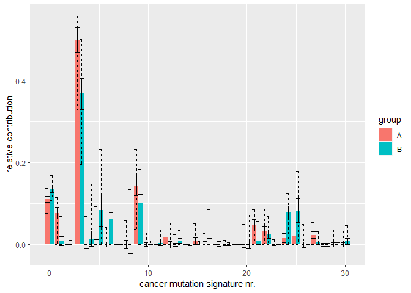

<!-- README.md is generated from README.Rmd. Please edit that file -->
MutSigs
=======

Fit known mutation signatures to collections of mutations.

Example
-------

We will fit COSMIC signatures to test data.

``` r
library(MutSigs)
library(tidyverse)
#> -- Attaching packages ---------------------------------------------------------------------------------------------------------------- tidyverse 1.2.1 --
#> v ggplot2 3.1.0     v purrr   0.2.5
#> v tibble  1.4.2     v dplyr   0.7.8
#> v tidyr   0.8.2     v stringr 1.3.1
#> v readr   1.1.1     v forcats 0.3.0
#> -- Conflicts ------------------------------------------------------------------------------------------------------------------- tidyverse_conflicts() --
#> x dplyr::filter() masks stats::filter()
#> x dplyr::lag()    masks stats::lag()
```

First, generate test data:

``` r
possibleSurroundings <-
  expand.grid(
    fistLetter=c("A", "C", "G", "T"),
    secondLetter=".",
    thirdLetter=c("A", "C", "G", "T")) %>%
  unite("surrounding", fistLetter, secondLetter, thirdLetter, sep="") %>%
  pull(surrounding)

possibleSubstitutions <-
  c("C>A", "C>G", "C>T", "T>A", "T>C", "T>G")

n <- 1000
set.seed(1234)

testData <- data.frame(
  surrounding = sample(possibleSurroundings, n, replace = TRUE),
  substitution = sample(possibleSubstitutions, n, replace = TRUE),
  group = sample(c("A", "B"),                n, replace = TRUE)
)
```

Second, perform the fitting:

``` r
result <- assessSignatures(testData,
                           group="group")
#> Loading required package: nnls
#> Loading required package: foreach
#> 
#> Attaching package: 'foreach'
#> The following objects are masked from 'package:purrr':
#> 
#>     accumulate, when
```

Finally, visualize the result:

``` r

result %>%
  separate(signature, c("sign", "signatureNr"), sep=10) %>%
  mutate(signatureNr = if_else(signatureNr=="", 0, as.numeric(signatureNr))) %>%
  ggplot(aes(x=signatureNr, 
             y=relC, 
             fill=group,
             ymin=relC-0.5*relSd,
             ymax=relC+0.5*relSd)) + 
  geom_bar(stat="identity", position="dodge") + 
  geom_errorbar(position="dodge") +
  geom_errorbar(position ="dodge",
                aes(ymin=relci95lower,
                    ymax=relci95upper),
                lty=2) +
  labs(y="relative contribution", x="cancer mutation signature nr.")
```


